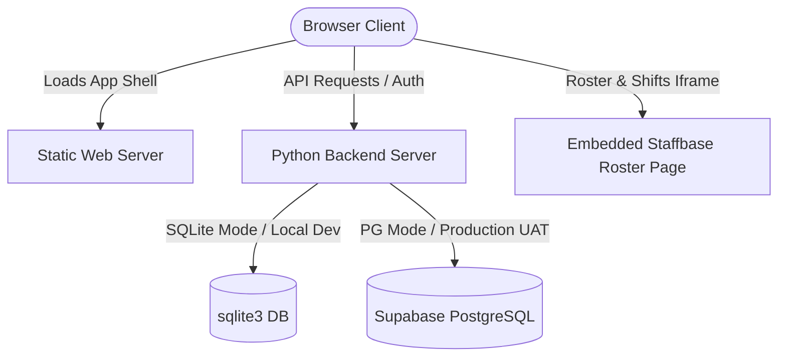
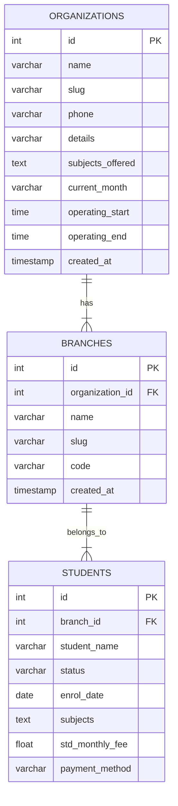

# After School Management Program (SMP) - Project Summary & Integration Guide

This document provides a comprehensive detail of the project architecture, file structures, database schemas, and integration points for the **After School Management Program (SMP)**, including the newly added **Multi-Branch Architecture** and **One-Time Centre Setup** features.

---

## 1. Project Overview & Architecture

The SMP Application is a modern, high-performance web dashboard built to manage student enrollments, fee collections, payment reconciliation, and staff shifts. It is built as a single-page progressive web application (PWA) with a robust backend API server.

### System Architecture

*   **Frontend**: Single Page Application (SPA) using vanilla HTML, vanilla CSS (with CSS custom variables for modern styling/themes), and modular JavaScript. Features standard Progressive Web App (PWA) caching for offline capabilities.
*   **Backend**: Python HTTP API server utilizing `http.server` for high efficiency, handling JSON request payloads, serving static assets, and managing direct database queries.
*   **Database**: Direct SQL execution supporting:
    *   **Local Development**: SQLite (`kumon_tracking.sqlite3`).
    *   **Production/UAT**: PostgreSQL (hosted on Supabase).

---

## 2. Source Code Locations & File Structure

Here is a map of the primary codebase files and their roles:

*   **Frontend Entry Point**: [index.html](file:///C:/Users/Surface/Documents/GitHub/smp-afterschool-management/index.html)
    *   Defines the modular layout, tabs, student administration grids, forms, and the new **One-Time Centre Setup** panel.
*   **Application Styling**: [styles.css](file:///C:/Users/Surface/Documents/GitHub/smp-afterschool-management/styles.css)
    *   Contains responsive layout properties, customized components, banners, and modern typography variables.
*   **Frontend App Logic**: [app.js](file:///C:/Users/Surface/Documents/GitHub/smp-afterschool-management/app.js)
    *   Coordinates UI state, navigation transitions, client-side validation, role-based view controls, and API communication.
*   **Backend Server**: [app.py](file:///C:/Users/Surface/Documents/GitHub/smp-afterschool-management/app.py)
    *   Processes backend routes (`/api/*`), manages SQL connections, runs startup table migrations, and validates authentication tokens.
*   **Progressive Web App Cache**: [sw.js](file:///C:/Users/Surface/Documents/GitHub/smp-afterschool-management/sw.js)
    *   Controls Service Worker caching strategy for key assets (`/index.html`, `/app.js`, `/styles.css`) to ensure offline availability.

---

## 3. Multi-Tenant & Branch Isolation Schema

To support multiple center branches, we implemented isolation tables and columns. On application startup, the backend automatically registers these schemas:

### Database Schema Entity-Relationship

*   **`organizations` Table**: Holds the high-level parent institution branding, operational hours, fee settings, and offering lists.
*   **`branches` Table**: Holds the specific local branch configurations, names, slugs, and a permanent **`code`** column.
*   **Data Isolation**: Every transaction, student record, attendance log, payment punch, and staff roster sheet contains a `branch_id` foreign key. Queries are restricted to the logged-in user's designated branch ID.

---

## 4. Key Functional Workflows

### A. One-Time Centre Setup Onboarding
During first-time installation (when `center_setup_completed` is `'0'`), the application restricts access:
1.  **UX Guard**: All regular dashboard tabs are disabled, and a setup banner warns the user.
2.  **Form Submission**: The user submits the Organization Name, Branch Name, and Branch Code.
3.  **API Call (`POST /api/centre-setup`)**:
    *   Renames the default organization and branch rows in the database.
    *   Saves the branch `code`.
    *   Sets `center_setup_completed = '1'` in metadata.
4.  **Completion**: Tabs are unlocked, the setup tab hides from the menu, and the user is redirected to the active dashboard.

### B. Admin-Only Settings Configuration
*   **Role Constraint**: Only users with the **`Admin`** role can edit the Organization Name, Branch Name, and Branch Code inside **Settings $\rightarrow$ Centre Info**.
*   **Non-Admin View**: Non-admin roles see these inputs in a read-only (disabled) state with a gray background and a block cursor.
*   **Persistence**: Saving changes updates the `organizations` and `branches` tables on the database.

---

## 5. Production & Deployment Integrations

*   **Hosting**: The production codebase is hosted on **Render** (linked directly to the GitHub repository branch `main`).
*   **Continuous Deployment**: Any push to `origin/main` automatically triggers Render to pull the code, compile/minify assets, and restart the server.
*   **Supabase Database**: 
    *   Production uses PostgreSQL hosted on **Supabase**.
    *   During deployment boot, the application startup hook `ensure_staff_tables()` checks the Supabase database schema and automatically updates tables without losing existing records.
*   **Staffbase Roster Integration**:
    *   The Staff Administration portal renders inside an iframe (`staffbase.html`).
    *   When settings change or on initial boot, `pushSettingsToStaffbase()` sends a secure `postMessage` containing the combined center label (`Organization Name - Branch Name`) and operating hours so the shift builder stays in sync.
